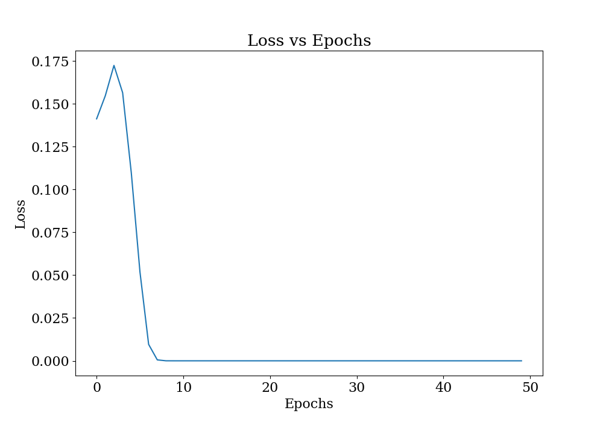
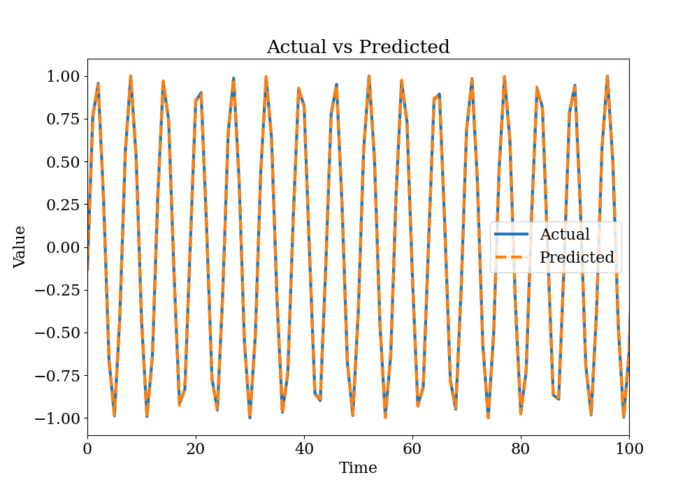

# Assignment 10

## Problem 1

This is a plot of loss with epochs. We can see that the loss is going down very quickly and becomes almost zero after 10 epochs. This is why I've trained it for only 50 epochs.

---

This plot shows the predicted value along with the ground truth. We can see a *perfect* match between the actual and predicted values.

---
