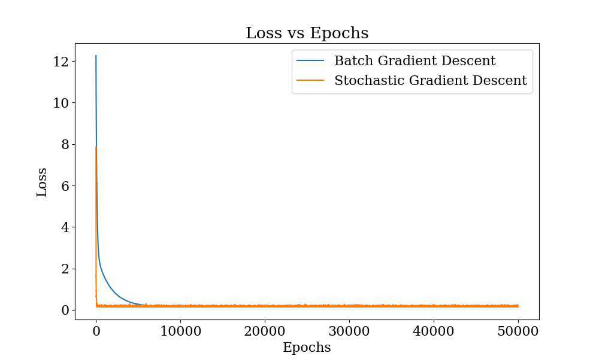
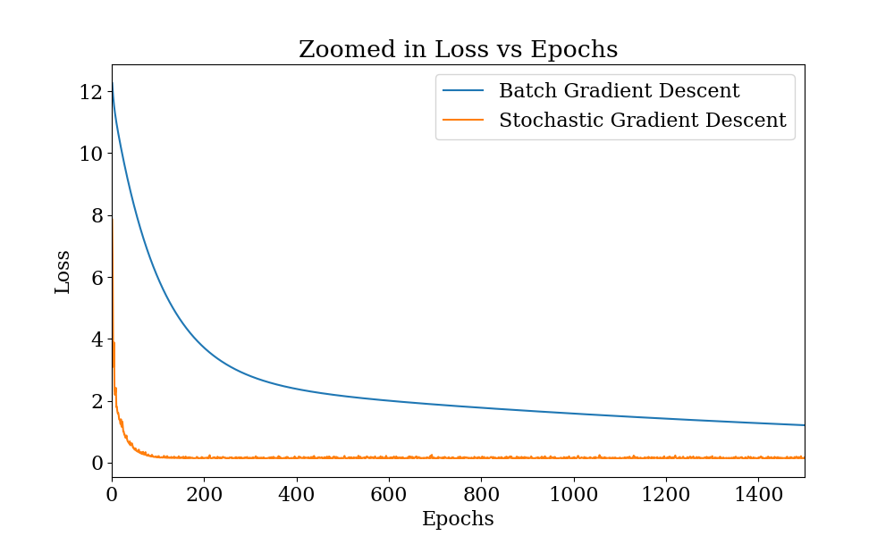
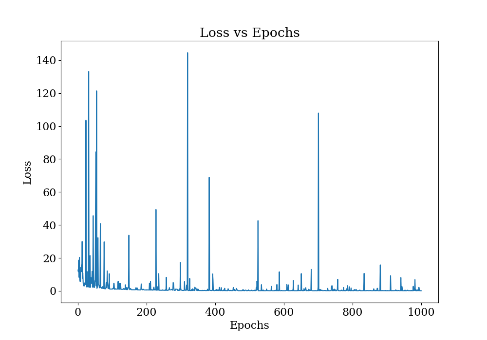

# Assignment 2

## Problem 1

The plot shows time on x axis and height reached by the ball on y axis. We can easily see a parabola. See section 3.1.1 for mathematical explanation.

---

Here, we have plotted the loss with number of epoch. Here are some of the observations found and difference between the SGD and BGD model:

1. For BGD, the loss is decreasing only up to 2000 epoch. After that, change in loss is almost negligible.
2. For SGD this starts happening even before 200 epoch!
3. SGD starts with much lower loss that the BGD.
4. SGD loss is fluctuating

---

This figure shows the losses at earlier epochs. It is clear from the figure that SGD is converging faster than BGD.

---

The figure shows the original data with the hypothesis functions learned by the models on top of them. We can see quite a good fit!

---

The plot of the loss $J$ with epochs is shown here. It seems we are getting overflow for some values of $\alpha$. This is happening because the value of $\alpha$ is too high and the gradient descent is diverging. So, this is what happening for $\alpha = 0.5$.

---

Since the loss is diverging for $\alpha = 0.5$, this plot exclude $\alpha=0.5$. We can see that the loss is decreasing most steeply for $\alpha = 0.1$

---

Next, we have the plot of loss with epoch for the method of steepest descent. We can see some jumps in the loss. This is because for that particular epoch, the $\alpha$ has particulary high value.

---

Since there were a lot of jumps in the original figure above, this figure sets a limit on the y axis to make the figure more readable.

---

Here is the plot of learning rate $\alpha$ with epoch. We can see that there are very few times where the learning rate is not too high, neither too low. This is the reason why the loss is fluctuating so much.

---

Finally, we have the plot of the hypothesis function learned by the steepest descent model on top of the original data points.

---

## Problem 2

Though, we are not required to plot $J$ versus epochs for this problem, I've done it anyway to show how the loss is changing with epochs. We can see that the loss is decreasing very steeply at first then after epoch somewhere near 1500, the loss is decreasing very slowly.

---

## Problem 3

Here, the loss, which is nothing but accuracy, is plotted against the number of iterations. We observe that:

1. The loss is not decreasing too much after epoch 10 or so.
2. Testing loss is always much lower that the training loss, showing that the model is not overfitting.

---

This figure shows the loss with number of epochs for the `LogisticGradientDescent` which I implemented while implementing gradient descent algorithms. This was not required for this problem.

---
