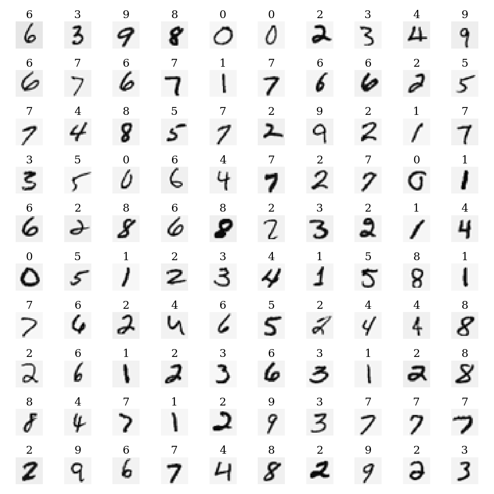
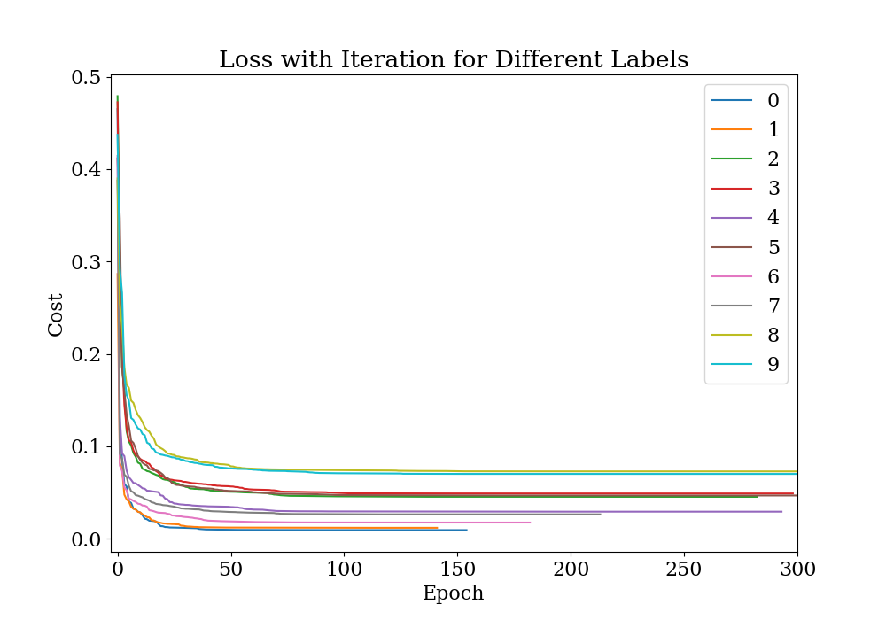
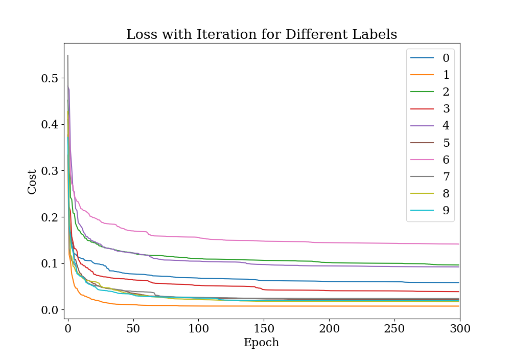
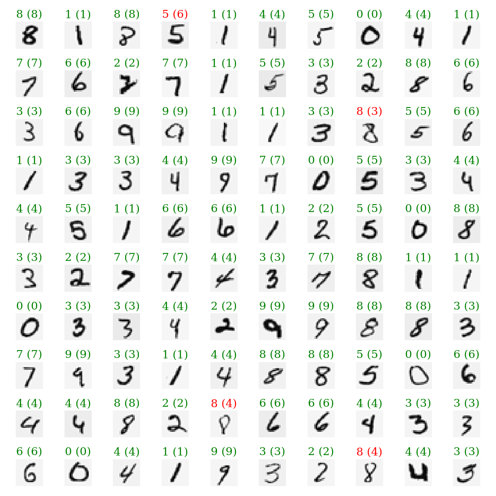
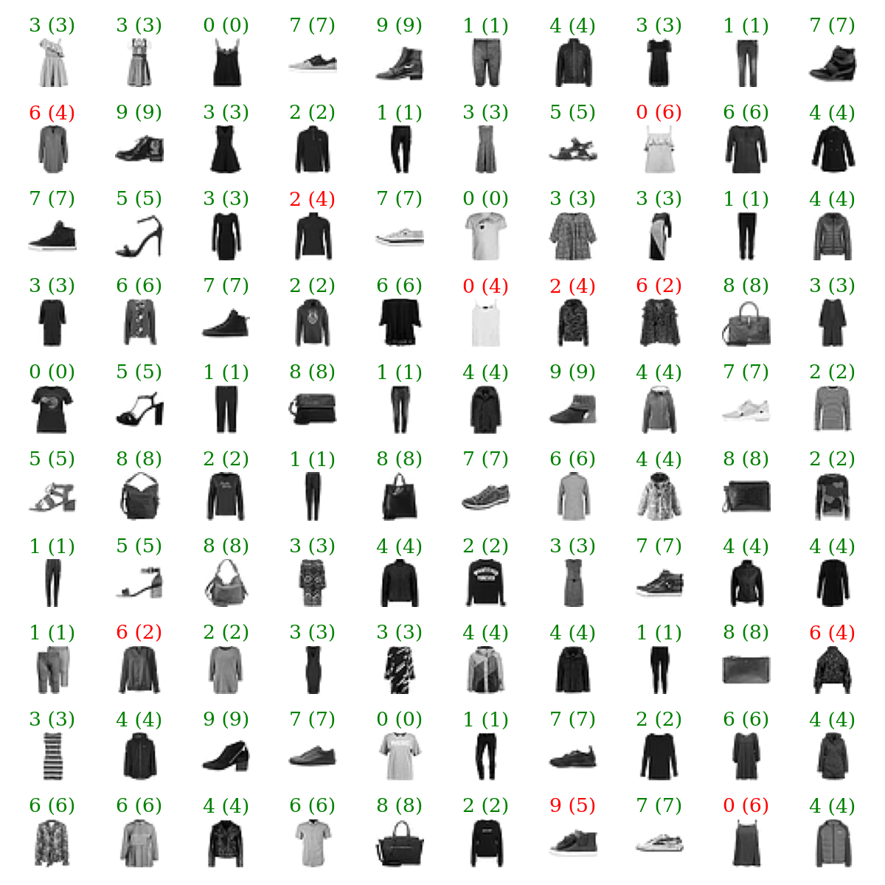
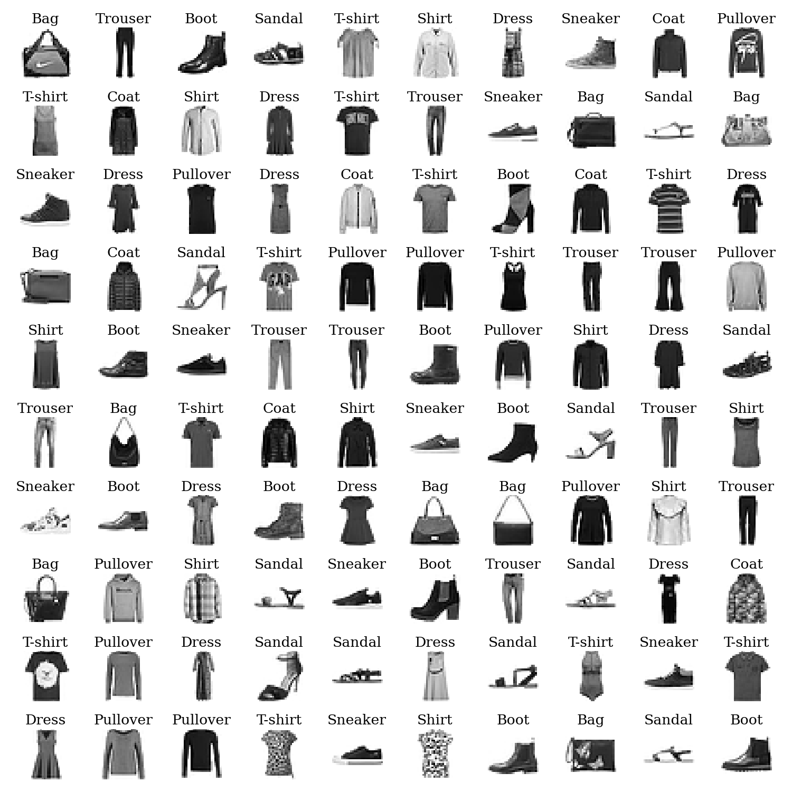
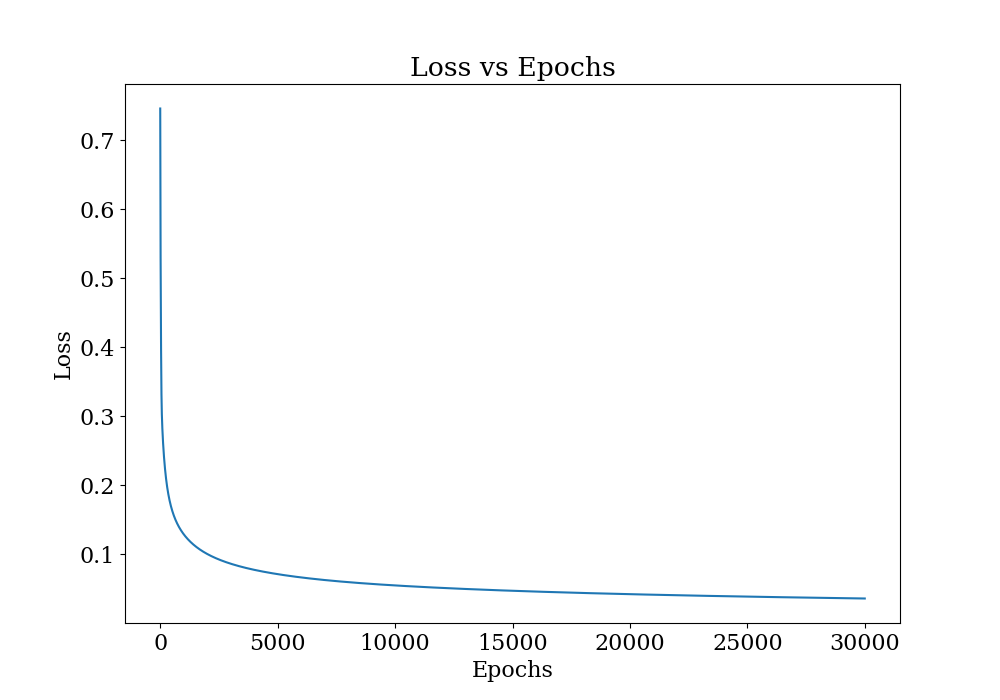
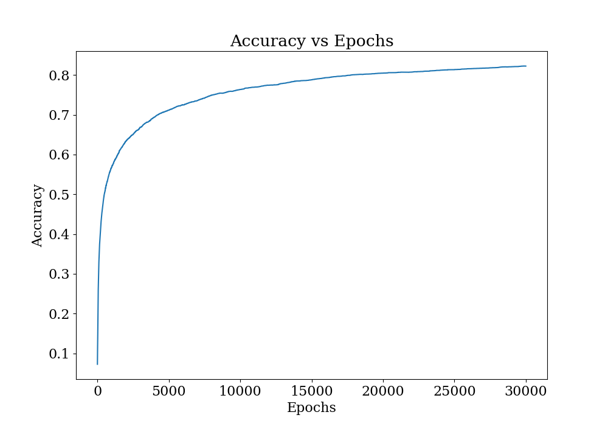
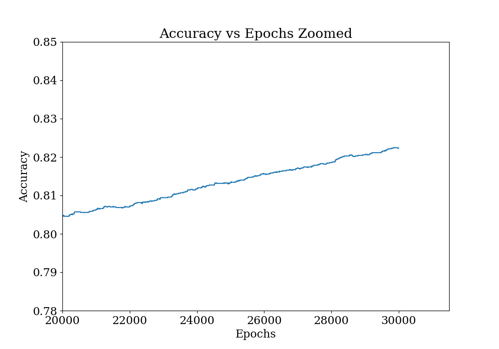

# Assignment 3

## Problem 1

Plot of 100 random digits with their correct label. We can see that some digits are very hard to make out.

---

## Problem 3

This is the plot of loss with iteration for each label for MNIST digits. Here are some of the observations

- We can see that the loss is decresing rapidly at first and after some epochs, it becomes almost constant.
- For some digits the cost is high and does not decreases even if the epochs increases. For example digits 8 and 9.
- For some digits, the model is converged way earlier such as 0 and 1.

---

This is the plot of loss with iteration for each label for MNIST fashion. Here are some of the observations

- We can see that the loss is decresing rapidly at first and after some epochs, it becomes almost constant.
- For some digits the cost is high and does not decreases even if the epochs increases. For example labels 6, 2 and 4, which corresponds to Shirt, Pillover and Sneaker.

---

## Problem 5

This is the plot of 100 random samples from the digits dataset along with the prediction made by the model. Some observations are:

- We can see that the model is able to predict most of the digits correctly.
- Model is sometimes gets confused with 8 and 4, 0 and 6. This is beacuse these digits have similar features.

---

This is the plot of 100 random samples from the fashion dataset along with the prediction made by the model. Some observations are:

- Model is less accurate than the digits dataset.

---

## Problem 6

This is the plot of 100 random samples from the fashion dataset. It is obvious that this dataset is going to be harder to learn. This is what we saw in the earlier plot.

---

The loss with epoch is plotted here. We can see that the loss is decreasing rapidly at first and then it becomes almost constant.

---

This is the accuracy with epoch for the fashion dataset. We can see that the accuracy is increasing with epochs.

---

This is a zoomed plot of loss with epochs. We see that the accuracy is still increasing. Which means we can keep on training the loss will increase further.

---
