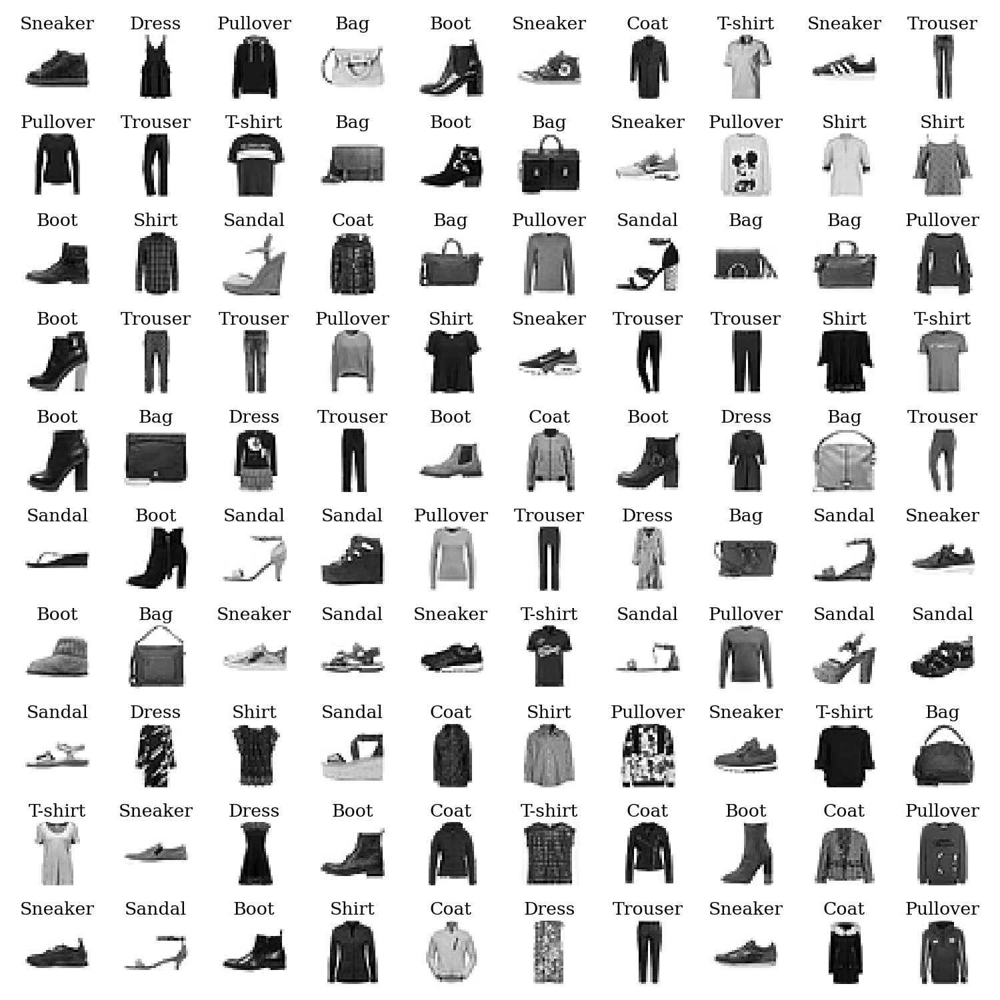

# Assignment 4

## Problem 1

This images shows 100 images from the training set and their labels.

---

## Problem 3

This is a graph showing the variation of the loss with epoch for the model using **sigmoid** activation function. We can see that the loss is decreasing with epoch.

---

This is a graph showing the variation of the accuracy with epoch for the model using **sigmoid** activation function. Here we can see that the accuracy is increasing with epoch. So, we can train the model for more epochs.

---

This is a graph showing the variation of the loss with epoch for the model using **ReLU** activation function.
Here too, we can see that the loss is decreasing with epoch.

---

This is a graph showing the variation of the accuracy with epoch for the model using **ReLU** activation function. Here, too we can see that the accuracy is increasing with epoch. So, we can train the model for more epochs.

Comparing the two graphs, we can see that the model with **ReLU** activation function is performing better than the model with **sigmoid** activation function.

---

## Problem 5

This is a plot of 100 random images from the test set and their labels for the model using **sigmoid** activation. We have:

- The 'true' and 'predicted' labels for each image.
- If the model is wrong, the 'true' and 'predicted' labels are shown in red.
- If the model is correct, the 'true' and 'predicted' labels are shown in green.

---

This is a plot of 100 random images from the test set and their labels for the model using **ReLU** activation. Same as before, we have:

- The 'true' and 'predicted' labels for each image.
- If the model is wrong, the 'true' and 'predicted' labels are shown in red.
- If the model is correct, the 'true' and 'predicted' labels are shown in green.

---

## Problem 7

This is a graph showing the variation of the loss with epoch for the model using **sigmoid** activation function as question 1.7 asks. We can see that the loss is decreasing with epoch.

---

This is a graph showing the variation of the loss with epoch for the model using **ReLU** activation function as question 1.7 asks. We can see that the loss is decreasing with epoch.

---

## Problem 8

This is plot of loss (Binary Cross Entropy) with epoch for the dataset in the second problem. The loss is decreasing with epoch and the model is performing well.

---

This is accuracy with epoch for the dataset in the second problem. The accuracy is increasing with epoch and we can train the model for more epochs.

---

Finally, here is the decision boundary for the dataset in the second problem. We can see that the decision boundary is not linear.

---
