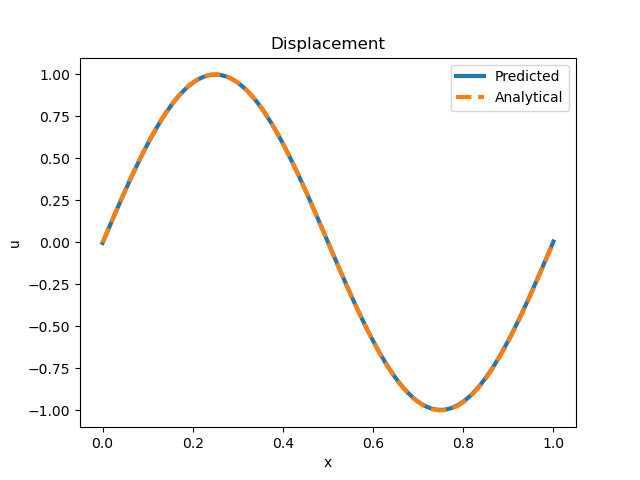

# Assignment 6

## Problem 1

This is the displacement with x plot. The analytic solution and the solution learned by the model are plotted on top of each other. The solution by the model is the solid blue line and the analytic solution is the dashed orange line. The model is able to learn the solution to the differential equation almost exactly in just 10 epochs!

---

This is the total loss plot. The loss is the mean squared error between the analytic solution and the solution learned by the model. The loss by the boundary points and the residual is added together to get the total loss. The total loss is plotted here. The loss decreases as the model learns the solution to the differential equation and becomes almost zero after 10 epochs.

---

## Problem 2

This is the $EA$ with x plot. Same as before, the analytic solution and the solution learned by the model are plotted on top of each other. The solution by the model is the solid blue line and the analytic solution is the dashed orange line. The model is able to learn the solution to the differential equation almost exactly in just 10 epochs!

---

Again, this is the total loss plot. The loss is the mean squared error between the analytic solution and the solution learned by the model. The total loss is plotted here. The loss decreases as the model learns the solution to the differential equation.

---
