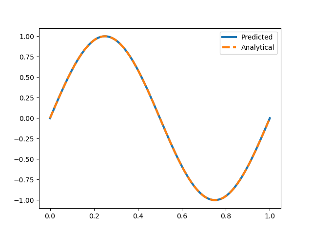
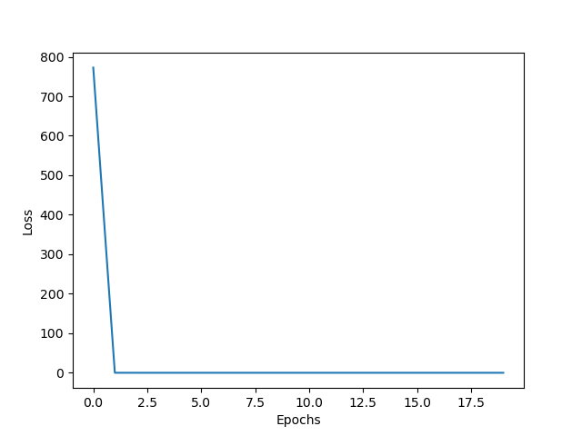
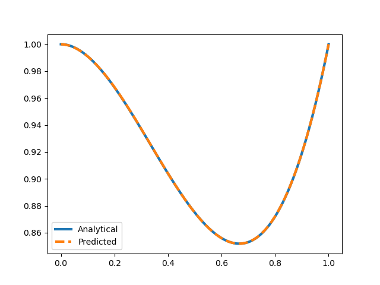
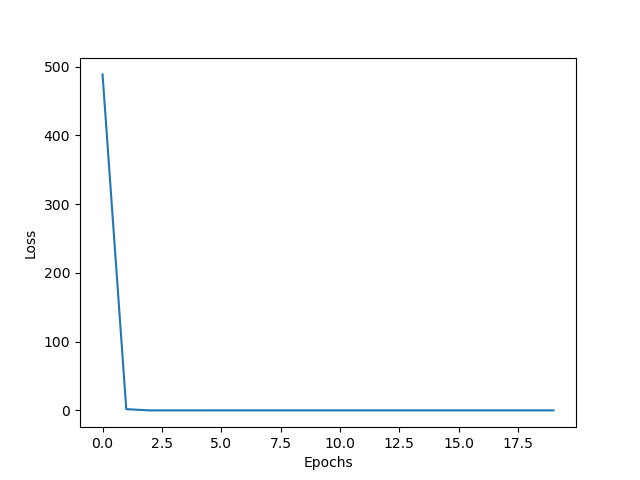

# Assignment 6

## Problem 1

This is the displacement with x plot. The analytic solution and the solution learned by the model are plotted on top of each other.

---

This is the total loss plot. The loss is decreasing and becomes almost zero after 10 epochs.

---

## Problem 2

This is the $EA$ with x plot. Same as before, the analytic solution and the solution learned by the model are plotted on top of each other.

---

This is the total loss plot. The loss is decreasing and becomes almost zero after 10 epochs.

---
