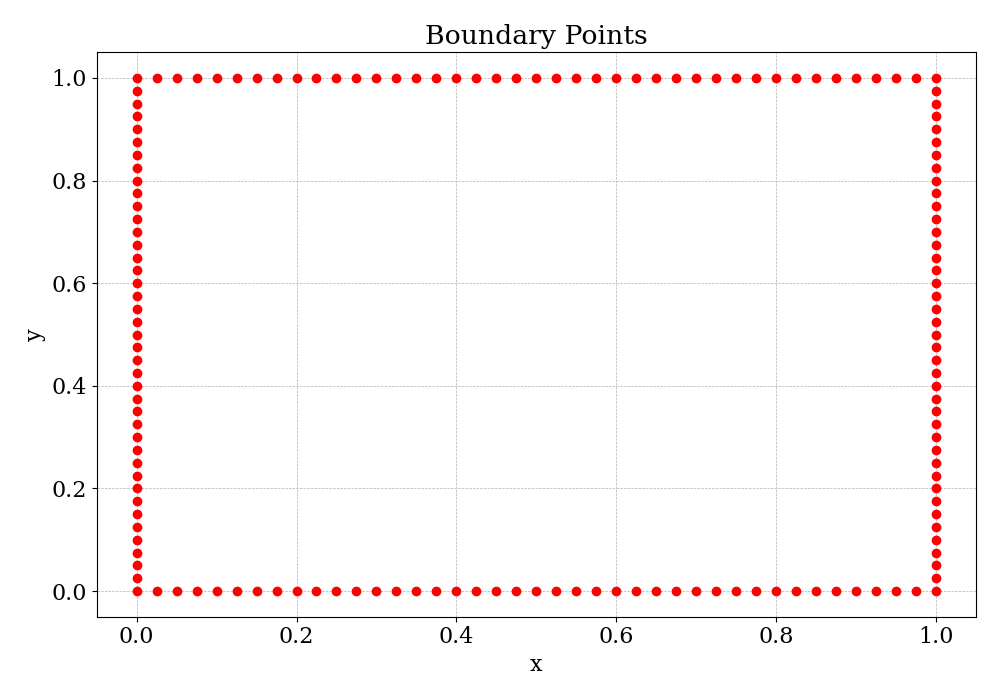
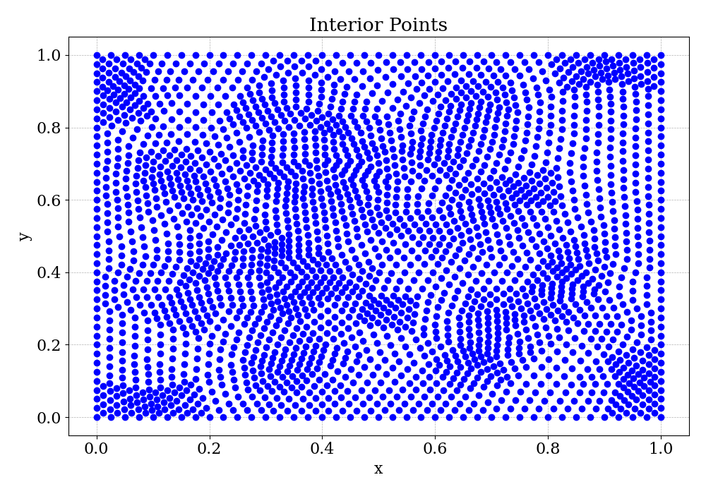
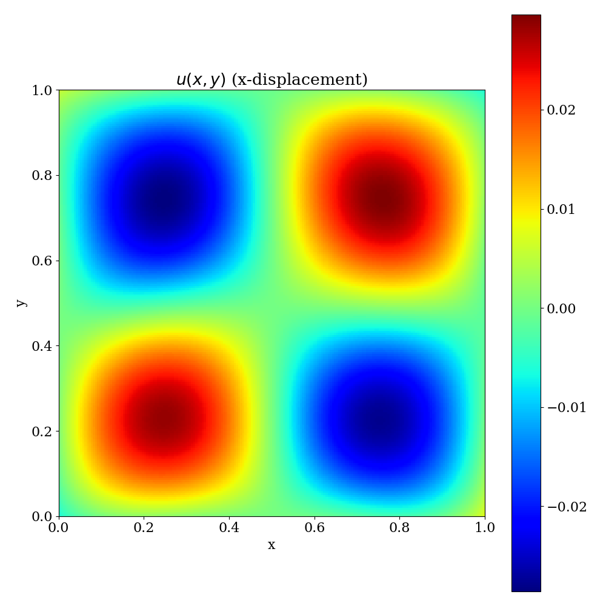
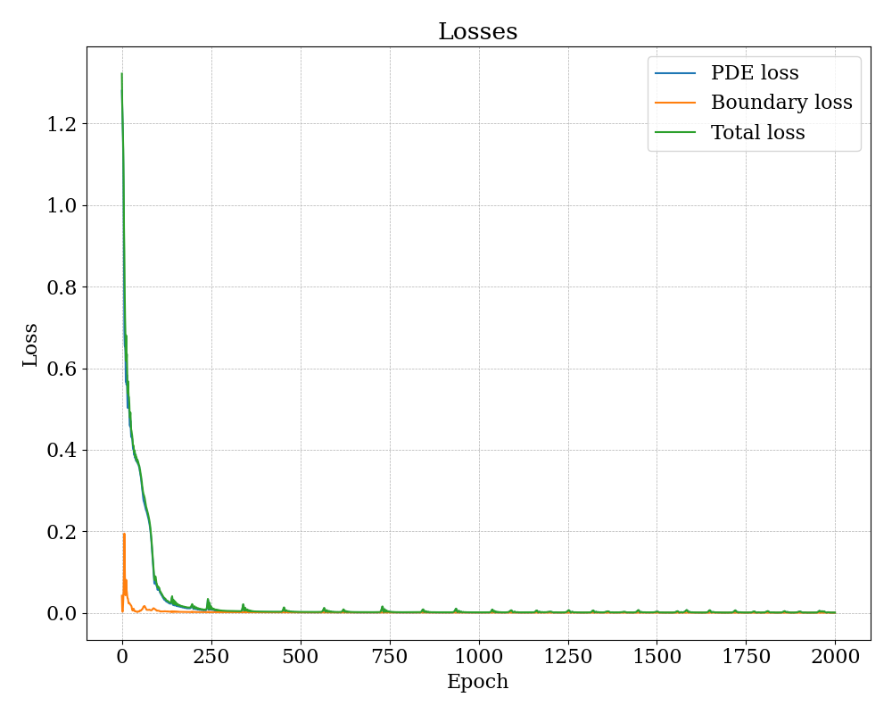

# Assignment 7

## Problem 1

This shows the boundary points chosen to calculate the boundary loss of the model.

---

These are the interior points. These wil be used as collocaiton points for training the model.

---

The figure shows the learned function $u(x,y)$, the x-displacement. We can see that the neural network has learned the displacement field.

---

This shows the function $v(x,y)$, the y-displacement learned by the model. The plot matches very well with the plot given in the problem ppt.

---

This shows different losses as a function of the number of iterations. You can see three loss lines:

- The first one is the boundary loss. This is the loss on the boundary points.
- The second one is the PDE loss. This is the residual loss on the interior points.
- The third one is the total loss. This is the sum of the boundary and interior loss.

We can see that all the losses are decreasing with the number of iterations. This shows that the model is learning the displacement.

---
