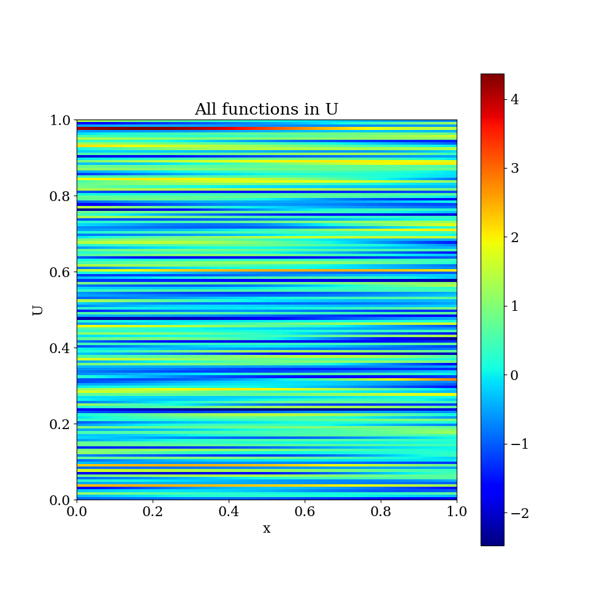
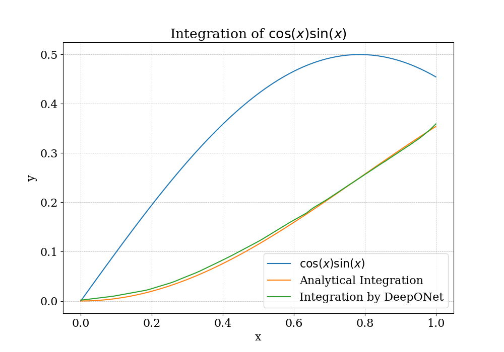

# Assignment 8

## Problem 1

This is a plot of the first 10 functions in the training set.

---

This is an image plot showing all the functions given in the training set. 

- There are 150 functions.
- 100 points are in each function.

---

This graph shows the training loss with number of epochs. We can see that the loss decreases very sharply.

---

Next, we will try to evaluate our anti-derviative operator on brand new functions. The first function used is $e^{-x}$. The function, its analytical integration and the integration learned by DeepONet is plotted on a single plot.

---

This is for the function $\cos(5x)$.

---

And finally, this is for the function $\cos(x)\sin(x)$.

---
