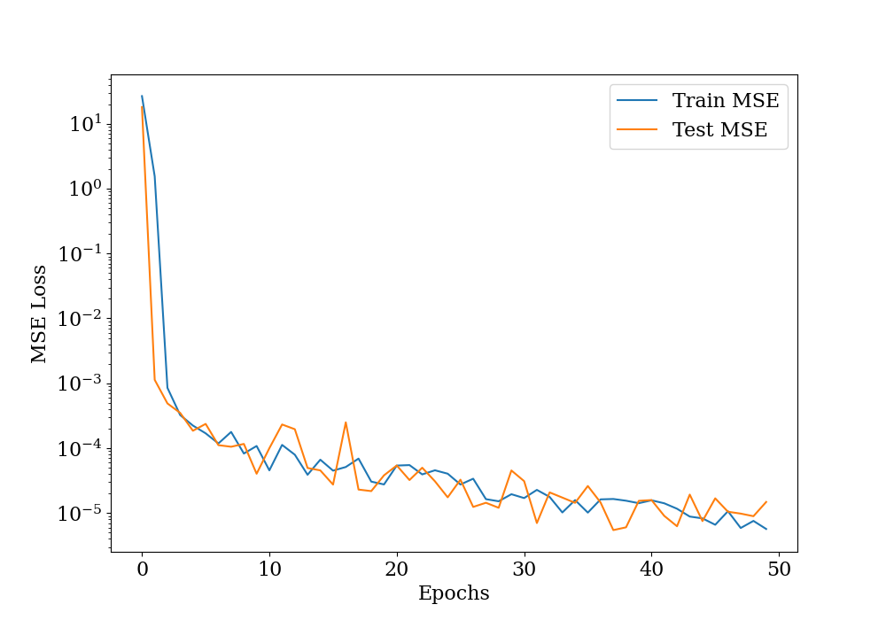
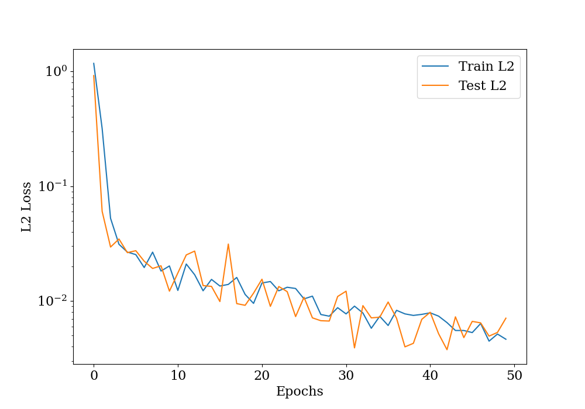

# Assignment 9

## Problem 1

This is a plot of epochs with train and test MSE losses. The y-axis is scaled logarithmically. We can see that the loss is decreasing with epochs. Both the train and test losses are very similar meaning that we can train for more epochs to get a better result.

---

This is a plot of epochs with train and test L2 loss. Here too, the y-axis is scaled logarithmically. We can see that the L2 loss is decreasing with epochs.

---
