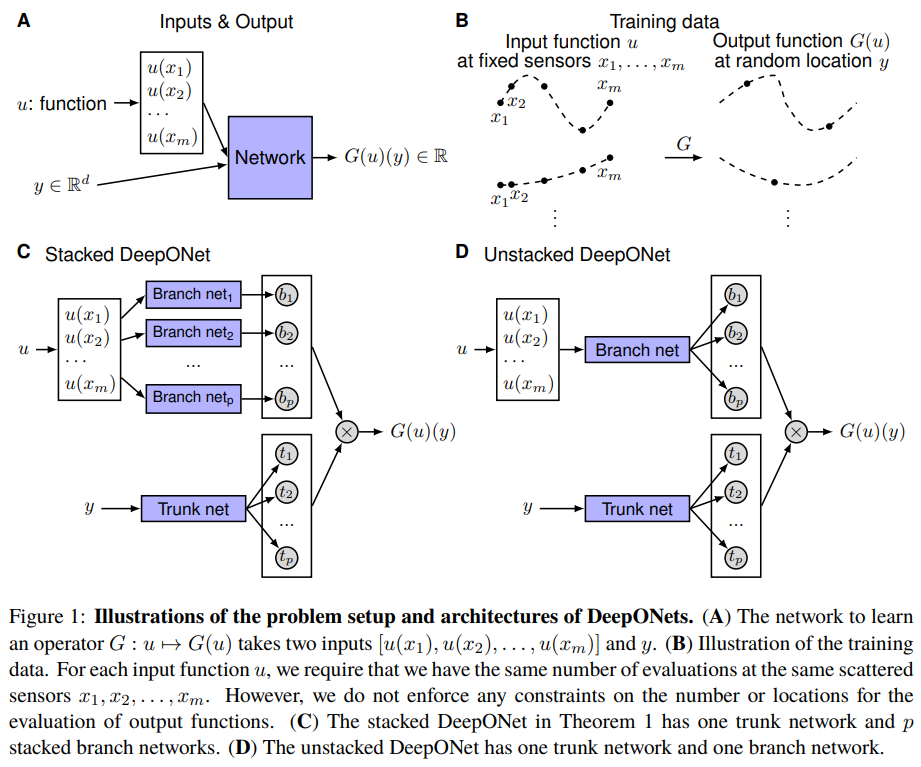
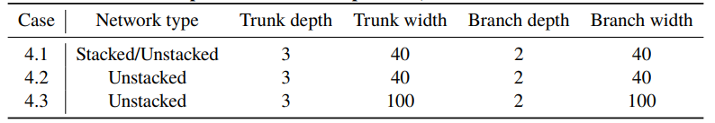

# DeepONet

## Introduction

While it is widely known that neural networks are universal approximators of continuous functions, a less known and perhaps more powerful result is that a neural network with a single hidden layer can approximate accurately any nonlinear continuous operator, that is, a neural network with a single hidden layer can approximate accurately any nonlinear continuous functional (a mapping from a space of functions into the real numbers) or (nonlinear) operator (a mapping from a space of functions into another space of functions).

> A DeepONet consists of two sub-networks, one for encoding the input function at a fixed number of sensors $x_i, i = 1,\ldots ,m$ (branch net), and another for encoding the locations for the output functions (trunk net).

Let's discuss some notations: Let $G$ be an operator taking an input function $u$, and then $G(u)$ is the corresponding output function. For any point $y$ in the domain of $G(u)$, the output $G(u)(y)$ is a real number. Hence, the network takes inputs composed of two parts: $u$ and $y$, and outputs $G(u)(y)$

### Universal Approximation Theorem for Operator

The universal approximation theorem basically tells that a neural network can learn virtually any operator, given that there are no constraint on the architecture. In fact, just one hidden layer is enough to approximate any operator.

At starting, it might seem that we can use neural networks to solve of any operator easily. However, this is not the case. For example, the universal approximation theorem of neural networks for functions shows that fully-connected neural networks (FNNs) are capable to approximate the ground-truth classification function accurately, but in practice the performance of FNNs is far from networks with specific architectures, such as the widely-used convolutional neural networks (CNN).

The performance gap lies in the fact that the accuracy of NNs can be characterized by dividing the total error into three main types: approximation, optimization, and generalization. The universal approximation theorems only guarantee a small approximation error for a sufficiently large network, but they do not consider the optimization error and generalization error at all, which are equally important and often dominant contributions to the total error in practice. Useful networks should be easy to train, i.e., exhibit small optimization error, and generalize well to unseen data, i.e., exhibit small generalization error.

## The Architecture of DeepONet

Before we talk about the architecture of the DeepONet, we can see that
One straightforward solution is to directly employ a classical network, such as FNN, CNN or RNN, and concatenate two inputs together as the network input, i.e., $[u(x_1), u(x_2),\ldots , u(x_m), y]^T$. This is not the most efficient way to do this. First, the input shape of the $u_i$ and $y$ might not match and second, this type of naive model does not perform that well. That's where DeepONet comes in.

DeepONet model has two different networks: the trunk and the branch. First, the trunk network takes $y$ as input and outputs $[t_1, t_2, \ldots, t_p]^T \in \mathbb{R}^p$. There are $p$ branch networks, each takes input $[u(x_1), u(x_2),\ldots , u(x_m)]^T$ and returns a scalar $b_k$. The final output is $G(u)(y) = \sum_{k=1}^p b_k t_k$ which approximates the operator:

$$
G(u)(y) \approx \sum_{k=1}^p b_k t_k + b_0
$$

Although bias is not necessary, adding bias may increase the performance by reducing the generalization error. In addition to adding bias to the branch networks, we may also add a bias $b_0\in \mathbb{R}$ in the last stage.

In practice, p is at least of the order of 10, and using lots of branch networks is computationally and memory expensive. Hence, we merge all the branch networks into one single branch network (Fig. 1D), i.e., a single branch network outputs a vector $[b_1, b_2, \ldots , b_p] \in \mathbb{R}^p$. The final output is $G(u)(y) = b^T t$.

Authors found that "unstacked DeepONets with bias achieve the best performance. In addition, unstacked DeepONets have fewer number of parameters than stacked DeepONets, and thus can be trained faster using much less memory".

### Data Generation

The function $u$ can be samled from a given distribution like Gaussian random field (GRF) or orthogonal Chebychev polynomials. The output function $G(u)$ can be generated by a given operator. The sensor locations $x_i$ can alo be generated from some distribution. In the paper, they used the following methods to generate the data:

After sampling u from the chosen function spaces, we solve the ODE systems by Runge-Kutta and PDEs by a second-order finite difference method to obtain the reference solutions. We note that one data point is a triplet $(u, y, G(u)(y))$, and thus one specific input $u$ may appear in multiple data points with different values of $y$. For example, a dataset of size 10000 may only be generated from 100 $u$ trajectories, and each evaluates $G(u)(y)$ for 100 $y$ locations.

## Some Examples

One of the simplest example which we can solve is in 1D system,

$$
\frac{ds(x)}{dx} = g(s(x), u(x), x), \quad x\in [0,1]
$$

with initial condition $s(0) = 0$. The goal is to predict $s(x)$ in the whole region $[0,1]$ for a given $u(x)$.

If we use $g(s(x), u(x), x) = u(x)$, we get the following result:

$$
\frac{ds(x)}{dx} = u(x), \quad x\in [0,1]
$$

which is nothing but the antiderivative operator, ie.:

$$
G:u(x) \mapsto s(x) = \int_0^x u(x) dx
$$
